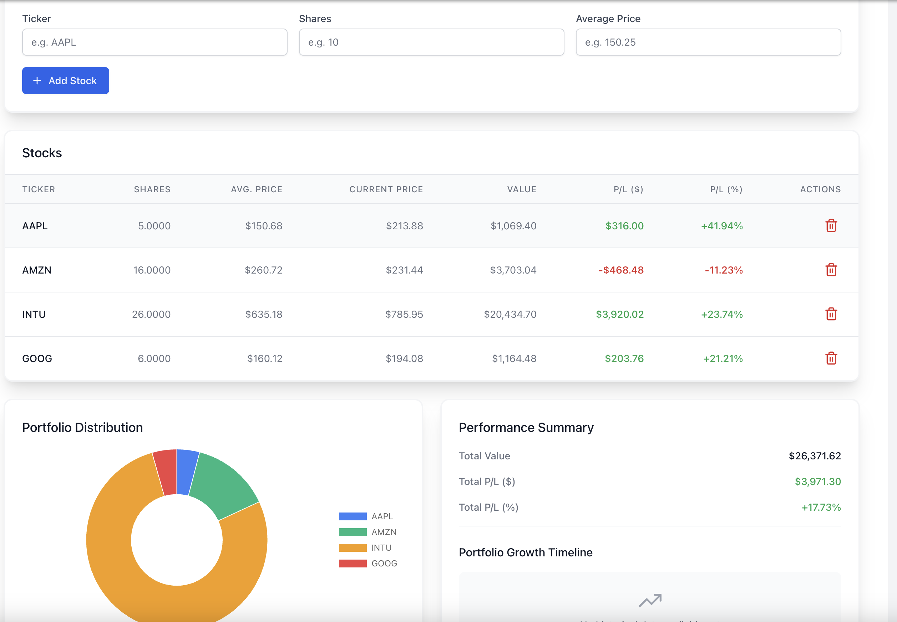

# 📊 Portfolio Analyzer

A modern web application for investment portfolio management with advanced analytics, intelligent recommendations, and real-time market data.

<div align="center">
  
  <p><em>Modern Portfolio Analyzer with P/L Analytics</em></p>
</div>

## ✨ Features

- **📈 Portfolio Management**: Track P/L, manage stocks, rename portfolios
- **🎯 Smart Recommendations**: Multi-timeframe dip analysis with weighted scoring
- **📊 Analytics**: Performance charts, historical tracking, portfolio growth timeline
- **📰 Market Sentiment**: Real-time news analysis with AI-powered sentiment scoring
- **🎨 Modern UI**: React 19 + TypeScript with responsive design

## 🚀 Tech Stack

**Frontend**: React 19, TypeScript, Tailwind CSS, Chart.js, React Query  
**Backend**: Python Flask, SQLAlchemy, SQLite  
**APIs**: Financial Modeling Prep, NewsAPI  
**AI**: NLTK sentiment analysis


## 🛠️ Quick Start

**Prerequisites**: Node.js 18+, Python 3.8+, API keys from [FMP](https://financialmodelingprep.com/) and [NewsAPI](https://newsapi.org/)

```bash
# Clone and setup
git clone https://github.com/SahasG/portfolio-analyzer.git
cd portfolio-analyzer

# Backend setup
cd backend
python -m venv venv
source venv/bin/activate  # Windows: .\venv\Scripts\activate
pip install -r requirements.txt
echo "FMP_API_KEY=your_key_here\nNEWS_API_KEY=your_key_here" > .env
python init_db.py

# Frontend setup
cd ../frontend
npm install
```

## 🚦 Running

```bash
# Start backend (Terminal 1)
cd backend && source venv/bin/activate && python app.py

# Start frontend (Terminal 2)
cd frontend && npm start
```

Open `http://localhost:3000` in your browser.

## 📱 Usage

1. **Create Portfolio** → Add stocks with ticker, shares, price
2. **View Analytics** → See P/L tracking and performance charts
3. **Get Recommendations** → Enter cash amount for dip-buying opportunities
4. **Track Sentiment** → View AI-powered news analysis

## 🧪 Testing

**Backend**: `cd backend && python -m pytest test_functions.py -v`  
**Frontend**: `cd frontend && npm test`

Both backend and frontend have comprehensive test coverage (100% frontend tests passing).

## 📄 License

MIT License - see [LICENSE](LICENSE) file.

---

<div align="center">
  Made with ❤️ by Sahas
</div>
